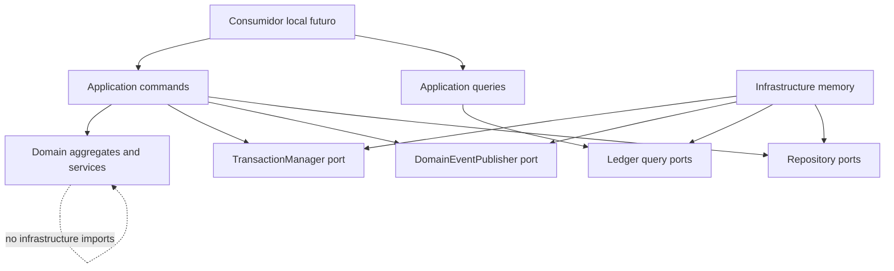
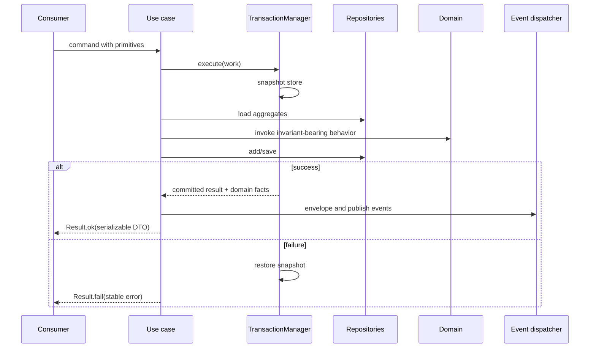

# Design do Núcleo Financeiro

**Spec**: `.specs/features/financial-domain-core/spec.md`
**Status**: Approved

---

## Chosen Approach

O núcleo será um monólito modular dividido em três pacotes compilados:

1. `@open-coin/domain`: regras financeiras puras, agregados, value objects e eventos.
2. `@open-coin/application`: commands, queries, casos de uso e portas.
3. `@open-coin/infrastructure-memory`: implementações em memória das portas, transação, consultas e publishers determinísticos.

O usuário aprovou esta abordagem em 2026-08-04.

### Alternatives Considered

| Approach | Benefit | Cost | Decision |
| --- | --- | --- | --- |
| Três pacotes por camada | Fronteiras explícitas, dependências verificáveis e adapters substituíveis | Mais configuração de build | Escolhida |
| Um pacote com diretórios internos | Menor custo inicial | Imports acidentais enfraquecem as fronteiras e dificultam extrair adapters | Rejeitada |
| Um pacote por bounded context | Isolamento máximo entre book, ledger e contextos futuros | Fragmentação prematura para o primeiro recorte | Rejeitada |

---

## Architecture Overview



As dependências de produção são unidirecionais:

```text
@open-coin/domain
        ▲
        │
@open-coin/application
        ▲
        │
@open-coin/infrastructure-memory
```

Nenhum pacote interno importa uma camada mais externa. O pacote de memória pode importar domínio e aplicação; aplicação importa apenas domínio; domínio não importa outros pacotes do produto.

### Command Transaction Flow



Erros tipados podem ser lançados internamente para abortar a transação. A fronteira pública de cada caso de uso os converte para `Result`; nenhum resultado de falha parcial é tratado como commit.

---

## Code Reuse Analysis

### Existing Components to Leverage

| Component | Location | How to Use |
| --- | --- | --- |
| TypeScript base config | `packages/typescript-config/base.json` | Base estrita `NodeNext`, `ES2022` e `noUncheckedIndexedAccess` para os três pacotes. |
| ESLint shared config | `packages/eslint-config/base.js` | Configuração comum dos novos pacotes sem regras duplicadas. |
| Turbo task graph | `turbo.json` | Orquestrar build, lint, typecheck e testes respeitando dependências de pacote. |
| pnpm workspace | `pnpm-workspace.yaml` | Descobrir automaticamente os três pacotes em `packages/*`. |
| Ignore rules | `.gitignore` | `dist`, cobertura e cache já estão excluídos do versionamento. |

Não existe código financeiro, runner de testes ou padrão de persistência reutilizável no starter.

### Integration Points

| System | Integration Method |
| --- | --- |
| Consumidores futuros | Imports apenas das APIs públicas de `@open-coin/application`; entidades não entram em commands ou DTOs. |
| SQLite futuro | Implementará as mesmas portas e os mesmos repository contracts, sem alterar domínio ou casos de uso. |
| Tauri/React futuro | Converterá inputs da UI em commands serializáveis e exibirá DTOs de query. |
| Integrações futuras | Executarão os casos de uso públicos, sem acesso direto a repositórios. |

---

## Package and Tooling Design

Cada pacote terá `package.json`, `tsconfig.json`, `tsconfig.build.json`, `eslint.config.mjs`, `src/index.ts` e scripts `build`, `lint`, `check-types` e `test`.

- Bibliotecas compilam `src` para `dist` com `tsc` e expõem JavaScript ESM mais declarações.
- Imports TypeScript internos usam extensões `.js`, conforme `moduleResolution: NodeNext`.
- O engine raiz passa de Node `>=18` para `>=20`; Vitest 4 requer Node 20 ou superior conforme o [guia oficial de migração](https://vitest.dev/guide/migration).
- Cada pacote executa `vitest run` em ambiente Node. O script raiz `test` executa `turbo run test`.
- A task `test` do Turbo depende do `build` das dependências. Testes de aplicação e infraestrutura encontram os pacotes internos já compilados.
- Comandos focados usam filtros pelo nome completo do pacote; este formato é suportado pela [documentação de filtering do pnpm](https://pnpm.io/filtering).
- Não será criado `vitest.workspace.*`; a configuração separada foi substituída por `test.projects` nas versões atuais, mas este recorte não precisa de projetos globais porque cada pacote possui um único ambiente Node. A referência é a [documentação oficial de Test Projects](https://vitest.dev/guide/projects.html).

---

## Components

### Shared Domain Kernel

- **Purpose**: Fornecer identidade, dinheiro, moeda, data local, erros, entidades, agregados, resultados e fatos de domínio puros.
- **Location**: `packages/domain/src/shared/`
- **Interfaces**:
  - `Currency.parse(code: string): Currency`
  - `Money.of(minorUnits: bigint, currency: Currency): Money`
  - `LocalDate.parse(value: string): LocalDate`
  - `Entity<Id>` e `AggregateRoot<Id, Snapshot>`
  - `Result<T, E>` como união discriminada imutável
- **Dependencies**: Somente TypeScript/JavaScript padrão determinístico.
- **Reuses**: Configuração TypeScript e ESLint compartilhada.

`AggregateRoot` mantém fatos de domínio não publicados. Snapshots nunca incluem essa fila transitória.

### Financial Book Module

- **Purpose**: Representar o limite de isolamento, moeda-base imutável e timezone do conjunto financeiro.
- **Location**: `packages/domain/src/book/`
- **Interfaces**:
  - `FinancialBook.create(input): FinancialBook`
  - `FinancialBook.restore(snapshot): FinancialBook`
  - `FinancialBook.toSnapshot(): FinancialBookSnapshot`
- **Dependencies**: Shared kernel.
- **Reuses**: `AggregateRoot`, branded `BookId`, `Currency` e erros de domínio.

A criação das quatro contas de sistema não pertence ao agregado `FinancialBook`; `CreateFinancialBook` coordena cinco agregados na mesma transação.

### Ledger Account Module

- **Purpose**: Representar contas financeiras, categorias e contas de sistema com tipo e saldo normal estáveis.
- **Location**: `packages/domain/src/ledger/accounts/`
- **Interfaces**:
  - `LedgerAccount.create(input): LedgerAccount`
  - `LedgerAccount.restore(snapshot): LedgerAccount`
  - `normalBalanceOf(kind): "DEBIT" | "CREDIT"`
  - `isFinancialAccount(account)` e `isCategoryAccount(account)`
- **Dependencies**: Shared kernel e `BookId`.
- **Reuses**: `AggregateRoot`, branded `LedgerAccountId` e erros tipados.

O nome armazenado recebe `trim`. A chave de duplicidade é produzida por `normalizeAccountName`: `trim`, Unicode NFC e minúsculas sem locale específico.

### Journal Module

- **Purpose**: Garantir lançamentos imutáveis, balanceados e reversíveis.
- **Location**: `packages/domain/src/ledger/journal/`
- **Interfaces**:
  - `Posting.create(input): Posting`
  - `JournalEntry.post(input): JournalEntry`
  - `JournalEntry.createReversal(input): JournalEntry`
  - `JournalEntry.markReversedBy(id): void`
  - `JournalEntry.toSnapshot()` e `JournalEntry.restore(snapshot)`
- **Dependencies**: Shared kernel e IDs de ledger.
- **Reuses**: `Money`, `Currency`, `LocalDate`, `AggregateRoot` e erros tipados.

`JournalEntry` persiste sua moeda, que deve ser a moeda-base carregada do livro. O agregado valida quantidade de postings, contas distintas, valores não zero, moeda única e soma zero. A aplicação valida que as contas existem, estão ativas e pertencem ao livro.

### Journal Entry Factory

- **Purpose**: Traduzir operações de negócio em postings assinados exatos.
- **Location**: `packages/domain/src/ledger/journal/journal-entry-factory.ts`
- **Interfaces**:
  - `setOpeningBalance(input): JournalEntry`
  - `recordExpense(input): JournalEntry`
  - `recordIncome(input): JournalEntry`
  - `transfer(input): JournalEntry`
- **Dependencies**: `FinancialBook`, `LedgerAccount`, `JournalEntry`, `Posting` e `Money`.
- **Reuses**: Predicados de papel/tipo e invariantes do journal.

A factory recebe IDs prontos. Ela não lê repositório, relógio ou gerador.

### Application Ports

- **Purpose**: Definir contratos de persistência, transação, consulta, IDs, tempo e eventos.
- **Location**: `packages/application/src/ports/`
- **Interfaces**:
  - `FinancialBookRepository`
  - `LedgerAccountRepository`
  - `JournalEntryRepository`
  - `LedgerQueries`
  - `TransactionManager`
  - `IdGenerator`, `Clock`, `DomainEventPublisher`
- **Dependencies**: Tipos públicos do domínio.
- **Reuses**: Nenhum adapter concreto.

Repositórios carregam e persistem raízes de agregação. `LedgerQueries` retorna DTOs e não expõe agregados.

### Book and Account Use Cases

- **Purpose**: Criar livro e contas de forma transacional, validar duplicidade e publicar eventos depois do commit.
- **Location**: `packages/application/src/book/` e `packages/application/src/ledger/accounts/`
- **Interfaces**:
  - `CreateFinancialBook.execute(command)`
  - `CreateFinancialAccount.execute(command)`
  - `CreateIncomeCategory.execute(command)`
  - `CreateExpenseCategory.execute(command)`
- **Dependencies**: Portas de aplicação e domínio.
- **Reuses**: Um executor comum de caso de uso para mapear erros e despachar eventos.

### Journal Command Use Cases

- **Purpose**: Registrar saldo inicial, fluxo, transferências e reversões de forma atômica.
- **Location**: `packages/application/src/ledger/journal/`
- **Interfaces**:
  - `SetOpeningBalance.execute(command)`
  - `RecordExpense.execute(command)`
  - `RecordIncome.execute(command)`
  - `TransferMoney.execute(command)`
  - `ReverseJournalEntry.execute(command)`
- **Dependencies**: Repositórios, transaction manager, IDs, clock, event dispatcher e journal factory.
- **Reuses**: Validadores comuns de livro/conta e conversores de command.

Cada command contém somente strings e primitivos. Valores monetários chegam como string inteira; outputs devolvem IDs e datas como strings.

### Ledger Query Use Cases

- **Purpose**: Autorizar o escopo do livro e expor saldo e extrato serializáveis.
- **Location**: `packages/application/src/ledger/queries/`
- **Interfaces**:
  - `GetAccountBalance.execute(query)`
  - `GetAccountStatement.execute(query)`
- **Dependencies**: Repositório de contas e `LedgerQueries`.
- **Reuses**: DTOs compartilhados da aplicação e normal balance do domínio.

O query adapter calcula postings em ordem cronológica ascendente para obter saldos correntes. O DTO final é ordenado por data e ID decrescentes.

### In-Memory Store and Repositories

- **Purpose**: Implementar contratos de persistência sem referências compartilhadas ou efeitos fora de `add`/`save`.
- **Location**: `packages/infrastructure-memory/src/store/` e `packages/infrastructure-memory/src/repositories/`
- **Interfaces**:
  - `InMemoryStore.snapshot()` e `restore(snapshot)`
  - Implementações dos três repositórios
- **Dependencies**: Domain snapshots e portas da aplicação.
- **Reuses**: Métodos `toSnapshot`/`restore` dos agregados.

O store mantém somente snapshots planos. Não usa `structuredClone` em instâncias de classe; isso perderia protótipos e poderia produzir testes enganosos.

### In-Memory Transaction Manager

- **Purpose**: Confirmar todas as alterações ou restaurar todo o store quando o callback lançar.
- **Location**: `packages/infrastructure-memory/src/transaction/in-memory-transaction-manager.ts`
- **Interfaces**:
  - `execute<T>(work: (repositories) => Promise<T>): Promise<T>`
- **Dependencies**: `InMemoryStore` e `RepositoryContext`.
- **Reuses**: Snapshots completos do store.

Callbacks nunca retornam falha como valor interno. Erros tipados são lançados até a fronteira do caso de uso para que rollback seja obrigatório.

### In-Memory Ledger Queries

- **Purpose**: Derivar saldo e extrato exclusivamente dos snapshots de journal.
- **Location**: `packages/infrastructure-memory/src/queries/in-memory-ledger-queries.ts`
- **Interfaces**: Implementa `LedgerQueries`.
- **Dependencies**: Store, snapshots e normal balance.
- **Reuses**: Nenhum estado de saldo materializado.

### Deterministic Test Adapters

- **Purpose**: Fornecer clock, IDs e publisher controláveis para testes de aplicação.
- **Location**: `packages/infrastructure-memory/src/testing/`
- **Interfaces**:
  - `FixedClock`
  - `SequentialIdGenerator`
  - `CollectingDomainEventPublisher`
- **Dependencies**: Portas da aplicação.
- **Reuses**: Arrays e sequências locais.

---

## Data Models

### FinancialBookSnapshot

```typescript
interface FinancialBookSnapshot {
  id: BookId
  name: string
  baseCurrency: string
  timezone: string
  version: number
}
```

### LedgerAccountSnapshot

```typescript
type LedgerAccountKind = "ASSET" | "LIABILITY" | "INCOME" | "EXPENSE" | "EQUITY"
type LedgerAccountStatus = "ACTIVE" | "ARCHIVED"
type SystemAccountPurpose =
  | "OPENING_BALANCE"
  | "RECONCILIATION_ADJUSTMENT"
  | "UNCATEGORIZED_INCOME"
  | "UNCATEGORIZED_EXPENSE"

interface LedgerAccountSnapshot {
  id: LedgerAccountId
  bookId: BookId
  name: string
  normalizedName: string
  kind: LedgerAccountKind
  status: LedgerAccountStatus
  systemPurpose?: SystemAccountPurpose
  version: number
}
```

### JournalEntrySnapshot

```typescript
interface PostingSnapshot {
  id: PostingId
  accountId: LedgerAccountId
  amountMinor: bigint
  currency: string
}

interface JournalEntrySnapshot {
  id: JournalEntryId
  bookId: BookId
  occurredOn: string
  description: string
  currency: string
  origin: "MANUAL" | "SYSTEM"
  postings: readonly PostingSnapshot[]
  reversalOf?: JournalEntryId
  reversedBy?: JournalEntryId
  version: number
}
```

### Domain Event Envelope

```typescript
interface DomainEventEnvelope<TType extends string, TPayload> {
  eventId: string
  type: TType
  occurredAt: string
  aggregateId: string
  bookId: string
  payload: TPayload
}
```

Agregados levantam fatos sem metadata técnica. Depois do commit, um dispatcher usa `IdGenerator` e `Clock` para criar envelopes e chama `DomainEventPublisher`.

### Query DTOs

```typescript
interface AccountBalanceDto {
  accountId: string
  asOf: string | null
  amountMinor: string
  currency: string
}

interface AccountStatementItemDto {
  journalEntryId: string
  occurredOn: string
  description: string
  amountMinor: string
  runningBalanceMinor: string
  currency: string
}
```

`bigint` nunca atravessa a fronteira serializável; DTOs usam strings inteiras.

---

## Repository and Query Contracts

```typescript
interface FinancialBookRepository {
  findById(id: BookId): Promise<FinancialBook | null>
  add(book: FinancialBook): Promise<void>
  save(book: FinancialBook, expectedVersion: number): Promise<void>
}

interface LedgerAccountRepository {
  findById(id: LedgerAccountId): Promise<LedgerAccount | null>
  findBySystemPurpose(bookId: BookId, purpose: SystemAccountPurpose): Promise<LedgerAccount | null>
  existsWithName(bookId: BookId, kind: LedgerAccountKind, normalizedName: string): Promise<boolean>
  add(account: LedgerAccount): Promise<void>
  save(account: LedgerAccount, expectedVersion: number): Promise<void>
}

interface JournalEntryRepository {
  findById(id: JournalEntryId): Promise<JournalEntry | null>
  add(entry: JournalEntry): Promise<void>
  save(entry: JournalEntry, expectedVersion: number): Promise<void>
}

interface LedgerQueries {
  getAccountBalance(input: { bookId: BookId; accountId: LedgerAccountId; asOf?: LocalDate }): Promise<AccountBalanceView>
  getAccountStatement(input: { bookId: BookId; accountId: LedgerAccountId }): Promise<readonly AccountStatementItemView[]>
}
```

`save` compara `expectedVersion` com o snapshot persistido. O agregado entregue para salvar já contém a versão incrementada; conflito mantém o snapshot anterior.

---

## Error Handling Strategy

| Error Scenario | Internal Handling | Public Result |
| --- | --- | --- |
| Input primitivo inválido | Conversor lança erro tipado antes de escrever | `Result.fail` com código de domínio/aplicação correspondente |
| Entidade ausente ou fora do livro | Caso de uso interrompe antes do domínio | `ENTITY_NOT_FOUND` |
| Duplicidade de nome ou ID | Repository/application error aborta transação | `DUPLICATE_ENTITY` |
| Lançamento inválido | `DomainError` aborta transação | Código exato da invariante, como `UNBALANCED_JOURNAL_ENTRY` |
| Reversão repetida | Agregado original rejeita transição | `JOURNAL_ENTRY_ALREADY_REVERSED` |
| Versão concorrente | `save` preserva snapshot e lança conflito | `OPTIMISTIC_CONCURRENCY_FAILURE` |
| Falha inesperada dentro da transação | Transaction manager restaura snapshot | `UNEXPECTED_ERROR`, sem exceção de infraestrutura exposta |

O publisher local confirmado no contexto não falha. Garantia de entrega, outbox e falha pós-commit não pertencem a este recorte.

---

## Test Strategy

Não existem guidelines ou testes no repositório. Aplicam-se os defaults fortes da especificação e da skill:

- Testes `*.test.ts` ficam próximos do código quando testam domínio puro.
- Cada critério FDC possui pelo menos uma asserção de resultado exato.
- Cada erro verifica o código estável e que nenhum estado foi alterado.
- Casos de uso são exercitados com implementações concretas em memória, não mocks de método.
- Contratos de repositório rodam contra cada implementação em memória.
- Testes de rollback capturam estado e eventos antes/depois.
- Builders de teste recebem IDs, datas e valores explícitos.
- Não há E2E, navegador ou banco neste recorte.

Vitest será instalado nos três pacotes. Testes de comportamento que cruzam aplicação e adapters ficam em `infrastructure-memory`, preservando a direção das dependências de produção e evitando dependência circular de teste.

---

## Requirement Allocation

| Component | Requirements |
| --- | --- |
| Shared kernel | FDC-01 a FDC-03, FDC-05 |
| Application ports, converters and error boundary | FDC-04, FDC-45, FDC-46, FDC-57, FDC-58 |
| Financial book | FDC-06 a FDC-11 |
| Ledger accounts | FDC-12 a FDC-17 |
| Journal and factory | FDC-18 a FDC-38 |
| Query use cases and adapter | FDC-39 a FDC-44 |
| In-memory repositories and transaction | FDC-47 a FDC-50, FDC-56 |
| Event dispatcher and publisher | FDC-51 a FDC-55, FDC-58 |

Alguns requisitos aparecem em mais de um componente porque descrevem um resultado que atravessa as fronteiras. A matriz de tarefas fará o mapeamento final 1:1.

---

## Risks & Concerns

| Concern | Location (file:line) | Impact | Mitigation |
| --- | --- | --- | --- |
| O starter não possui runner, scripts ou testes | `package.json:5` | Não há gate executável para os 58 requisitos | Adicionar Vitest, scripts por pacote e task `test` no Turbo antes do primeiro código de domínio. |
| O engine atual aceita Node 18, incompatível com Vitest 4 | `package.json:17` | Instalação ou execução pode falhar em ambientes Node 18 | Elevar o engine para Node 20 e documentar o requisito no tooling. |
| `structuredClone` não reidrata protótipos de classes | Novo adapter em memória | Agregados carregados poderiam perder comportamento ou compartilhar estado de forma enganosa | Persistir snapshots planos e chamar factories `restore`. |
| Evento pós-commit não tem outbox | Decisão confirmada no contexto | Uma futura integração assíncrona poderia perder evento | Manter publisher local não falhável neste recorte; especificar outbox junto do adapter persistente. |
| Ordenação por ID opaco é apenas determinística, não temporal | FDC-42 | Dois lançamentos no mesmo dia não refletem necessariamente ordem de criação | Preservar o contrato aprovado; uma futura necessidade de ordem intradiária exigirá novo campo e migração. |
| Todos os saldos são recalculados em memória | Novo query adapter | Custo cresce linearmente com o ledger | Aceitável para o adapter de prova; SQLite futuro terá índices/read models sem mudar `LedgerQueries`. |
| Os casos de uso e o adapter precisam ser testados juntos sem ciclo de pacote | Novos pacotes | Testes colocados no pacote application não podem depender do adapter externo | Hospedar testes cross-layer em `infrastructure-memory`; domínio continua com testes unitários locais. |

---

## Tech Decisions

| Decision | Choice | Rationale |
| --- | --- | --- |
| Package boundaries | Três pacotes compilados com dependências inward-only | Escolha aprovada e registrada em AD-003. |
| Module format | ESM + TypeScript `NodeNext` | Reusa a configuração estrita existente e produz bibliotecas compatíveis com consumidores modernos. |
| Build | `tsc` com `src` para `dist` | Não introduz bundler para bibliotecas puras. |
| Test runner | Vitest 4 em ambiente Node | Escolha aprovada; integra-se diretamente ao TypeScript e ao monorepo. |
| Minimum Node | Node 20 | Requisito do runner atual e coerente com `@types/node` 22 já usado pelo starter. |
| Persistence representation | Snapshots planos + `restore` | Preserva isolamento e protótipos sem serializar comportamento. |
| Application failure model | Throw interno para abortar; `Result` na fronteira | Garante rollback para qualquer falha e mantém API explícita. |
| Query model | Derivado dos postings | Ledger permanece fonte de verdade; nenhum saldo autoritativo duplicado. |
| Event metadata | Envelope criado depois do commit | Domínio não acessa relógio ou gerador e publisher só recebe eventos confirmados. |
