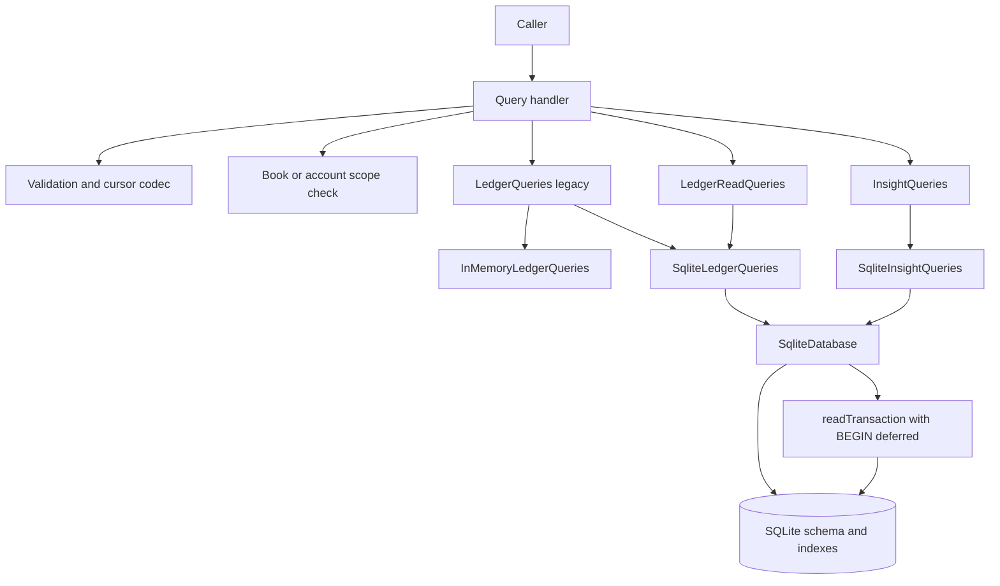

# Design das Queries Financeiras do Ledger

**Spec**: `.specs/features/financial-ledger-queries/spec.md`
**Context**: `.specs/features/financial-ledger-queries/context.md`
**Status**: Approved
**Architecture choice**: Opção 1 confirmada em 2026-08-04
**Approved on**: 2026-08-04

---

## Architecture Overview

O design mantém `LedgerQueries` como contrato legado de saldo e extrato sem paginação. Dois ports novos separam as novas capacidades por contexto:

- `LedgerReadQueries`: lista de saldos, extrato paginado e lista global de lançamentos.
- `InsightQueries`: fluxo de caixa mensal, gastos por categoria e patrimônio líquido.

`SqliteLedgerQueries` implementa o port legado e `LedgerReadQueries`. `SqliteInsightQueries` implementa os indicadores. `InMemoryLedgerQueries` continua implementando somente o contrato legado.

Cada capacidade possui um handler na aplicação. O handler valida primitivos, resolve o escopo do livro ou conta, decodifica cursores e converte falhas para `Result`. O adapter recebe tipos validados, executa SQL parametrizado e retorna slices tipados. O handler transforma a chave de continuação em cursor opaco.



### Read paths

```text
Primitive query
  -> handler validation
  -> book/account scope validation
  -> typed query port input
  -> one SELECT or one deferred read transaction
  -> SQLite rows
  -> immutable read model or typed slice
  -> cursor encoding
  -> Result<view, ApplicationError>
```

### Compatibility paths

```text
GetAccountBalance
  -> existing LedgerQueries
  -> memory or SQLite
  -> enriched AccountBalanceView with amountMinor preserved

GetAccountStatement
  -> existing LedgerQueries
  -> memory or SQLite
  -> existing readonly array contract

ListAccountStatement
  -> new LedgerReadQueries
  -> SQLite only
  -> paginated AccountStatementPage
```

---

## Approach Analysis

| Approach | Result | Decision |
| --- | --- | --- |
| Preserve `LedgerQueries`; add grouped ledger and insight ports | Keeps verified legacy contracts and avoids duplicating reports in memory | **Chosen** |
| One SQLite class implementing every port | Minimizes classes but concentrates unrelated aggregation and pagination logic | Rejected |
| One infrastructure class per query behind grouped façades | Maximizes isolation but adds wiring and boilerplate before query complexity justifies it | Rejected |

The chosen approach conforms to AD-001 through AD-004. AD-005 records the newly confirmed project-wide read-side convention.

---

## Code Reuse Analysis

### Existing Components to Leverage

| Component | Location | How to Use |
| --- | --- | --- |
| `LedgerQueries` | `packages/application/src/ports/queries.ts` | Preserve the two legacy methods and enrich only `AccountBalanceView`. |
| Query handler pattern | `packages/application/src/ledger/queries/get-account-balance.ts` | Reuse parsing, scope validation, `Result` and error-boundary structure. |
| `normalBalanceOf` | `packages/domain/src/ledger/accounts/ledger-account.ts` | Centralize raw-to-display sign conversion for every read model. |
| `LocalDate` | `packages/domain/src/shared/local-date.ts` | Validate `YYYY-MM-DD` inputs before the adapter. |
| Financial repositories | `packages/application/src/ports/repositories.ts` | Validate book and target-account scope without turning repositories into report APIs. |
| `SqliteExecutor` and `SqliteDatabase` | `packages/infrastructure-sqlite/src/database/` | Bind all values and host single-statement or snapshot-consistent reads. |
| `mapSqliteError` | `packages/infrastructure-sqlite/src/database/sqlite-error.ts` | Normalize driver failures before they cross the infrastructure boundary. |
| Migration generator and runner | `packages/infrastructure-sqlite/scripts/generate-migrations.mjs` | Add a canonical `0002` migration and regenerate the checked-in list. |
| `SqliteLedgerQueries` | `packages/infrastructure-sqlite/src/queries/sqlite-ledger-queries.ts` | Retain legacy behavior and add operational list methods. |
| Better SQLite test driver | `packages/infrastructure-sqlite/tests/support/better-sqlite-database.ts` | Implement and verify deferred read transactions and statement instrumentation. |
| Existing contract scenarios | `packages/infrastructure-sqlite/tests/contracts/query-use-cases.test.ts` | Preserve memory/SQLite parity only for the two legacy handlers. |

### Integration Points

| System | Integration Method |
| --- | --- |
| Application public API | Export primitive query inputs, pages, views, grouped ports and handlers from existing package entrypoints. |
| Domain | Import branded IDs, `LocalDate`, account kinds and `normalBalanceOf`; never return aggregates. |
| SQLite schema | Read `financial_books`, `ledger_accounts`, `journal_entries` and `postings` without adding mutable read tables. |
| SQLite transaction contract | Extend `SqliteDatabase` with a query-only callback executed under `BEGIN` deferred. |
| Migrations | Add indexes only; do not rewrite existing tables or snapshots. |

---

## Components

### Legacy Query Contract

- **Purpose**: Preserve verified saldo and unpaged statement consumers.
- **Location**: `packages/application/src/ports/queries.ts`
- **Interfaces**:
  - `LedgerQueries.getAccountBalance(input): Promise<AccountBalanceView>`
  - `LedgerQueries.getAccountStatement(input): Promise<readonly AccountStatementItemView[]>`
- **Changes**:
  - Add `accountName`, `accountKind`, `rawBalanceMinor` and `displayBalanceMinor` to `AccountBalanceView`.
  - Keep `amountMinor` as an exact alias of `displayBalanceMinor`.
  - Keep `AccountStatementItemView` and `GetAccountStatement` behavior unchanged.
- **Dependencies**: Branded domain IDs and `LocalDate`.
- **Reuses**: Existing memory and SQLite adapters and shared contract tests.

### Public Query Inputs and Views

- **Purpose**: Define serializable request and response contracts separately from typed adapter inputs.
- **Location**:
  - `packages/application/src/ports/query-inputs.ts`
  - `packages/application/src/ports/ledger-read-queries.ts`
  - `packages/application/src/ports/insight-queries.ts`
- **Interfaces**:
  - `ListAccountBalancesQuery`
  - `ListAccountStatementQuery`
  - `ListJournalEntriesQuery`
  - `GetMonthlyCashFlowQuery`
  - `GetCategorySpendingQuery`
  - `GetNetWorthQuery`
  - `LedgerReadQueries`
  - `InsightQueries`
- **Dependencies**: Public primitives for callers; branded IDs, `LocalDate` and validated cursor keys inside ports.
- **Reuses**: Existing `AccountBalanceQuery`, `AccountStatementQuery` and readonly DTO style.

### Query Validation and Cursor Codec

- **Purpose**: Convert untrusted primitive inputs once, before any adapter call.
- **Location**: `packages/application/src/querying/`
- **Interfaces**:
  - `parseRequiredId(value, field): string`
  - `parseOptionalDate(value, field): LocalDate | undefined`
  - `parseMonth(value, field): YearMonth`
  - `parseLimit(value): number`
  - `decodeStatementCursor(value): StatementCursorKey`
  - `encodeStatementCursor(key): string`
  - `decodeJournalEntryCursor(value): JournalEntryCursorKey`
  - `encodeJournalEntryCursor(key): string`
- **Cursor format**:
  - Statement: `s1.<occurredOn>.<sequence>.<postingPosition>`
  - Journal list: `j1.<occurredOn>.<sequence>`
- **Rules**:
  - The format is versioned and treated as opaque by callers.
  - Date, decimal sequence and non-negative safe position are validated.
  - A wrong prefix, field count or value returns `INVALID_QUERY`.
  - Cursors carry ordering keys only. They do not assert entity existence or authorization.
- **Dependencies**: `LocalDate` and `ApplicationError`.
- **Reuses**: Decimal-string comparison semantics already used by the legacy adapters.

### Application Query Handlers

- **Purpose**: Validate inputs, enforce scope, call one port and return public views.
- **Location**:
  - `packages/application/src/ledger/queries/list-account-balances.ts`
  - `packages/application/src/ledger/queries/list-account-statement.ts`
  - `packages/application/src/ledger/queries/list-journal-entries.ts`
  - `packages/application/src/insights/queries/get-monthly-cash-flow.ts`
  - `packages/application/src/insights/queries/get-category-spending.ts`
  - `packages/application/src/insights/queries/get-net-worth.ts`
- **Interfaces**: Each class exposes `execute(query): Promise<Result<View, ApplicationError>>`.
- **Dependencies**:
  - `FinancialBookRepository` for book-scoped lists and indicators.
  - `LedgerAccountRepository` for the target account statement.
  - `LedgerReadQueries` or `InsightQueries` for data access.
  - Query validation, cursor codec and safe error mapping.
- **Reuses**: Existing `GetAccountBalance` and `GetAccountStatement` handler shape.

### Safe Query Error Boundary

- **Purpose**: Ensure unexpected repository, adapter or row-mapping failures never expose SQL or driver details.
- **Location**: `packages/application/src/querying/query-error.ts`
- **Interface**: `toQueryApplicationError(error): ApplicationError`
- **Behavior**:
  - Preserve existing `ApplicationError`.
  - Convert `DomainError` to the same stable code and safe message.
  - Convert every other value to `UNEXPECTED_ERROR` with `Financial query failed`.
- **Dependencies**: `ApplicationError` and `DomainError`.
- **Reuses**: The shape of `toApplicationError` without its generic `error.message` pass-through.

### SQLite Reader and Deferred Read Transaction

- **Purpose**: Guarantee one snapshot for multi-statement queries without acquiring the writer lock at transaction start.
- **Location**: `packages/infrastructure-sqlite/src/database/`
- **Interfaces**:
  - `SqliteReader.query<Row>(sql, parameters?): Promise<Row[]>`
  - `SqliteExecutor extends SqliteReader`
  - `SqliteDatabase.readTransaction<T>(work: (reader: SqliteReader) => Promise<T>): Promise<T>`
- **Behavior**:
  - Enqueue the complete callback on the existing connection queue.
  - Execute `BEGIN`, not `BEGIN IMMEDIATE`.
  - Commit on success and rollback on callback or commit failure.
  - Invalidate the scoped reader after completion.
  - Expose no `execute` or `executeBatch` method through the callback type.
- **Dependencies**: Platform-neutral database contract; concrete implementation remains test-driver-owned.
- **Reuses**: Queue, scoped lifetime and rollback mechanics of the current write transaction.

### SQLite Query Value Helpers

- **Purpose**: Parse unknown driver rows and apply financial conversions consistently.
- **Location**: `packages/infrastructure-sqlite/src/queries/sqlite-query-values.ts`
- **Interfaces**:
  - `readString`, `readBigInt`, `readInteger`, `readBoolean`
  - `readAccountKind`, `readAccountStatus`, `readJournalOrigin`
  - `toDisplayMinor(raw, kind)`
  - `compareDecimalStrings(left, right)`
- **Dependencies**: `normalBalanceOf` and public domain enums.
- **Reuses**: Existing private helpers in `sqlite-ledger-queries.ts`.

### SqliteLedgerQueries

- **Purpose**: Implement legacy balance/statement plus the three operational list capabilities.
- **Location**: `packages/infrastructure-sqlite/src/queries/sqlite-ledger-queries.ts` and focused SQL modules under `packages/infrastructure-sqlite/src/queries/sql/` when a statement exceeds a readable inline size.
- **Interfaces**:
  - Legacy `LedgerQueries`
  - New `LedgerReadQueries`
- **Dependencies**: `SqliteDatabase`, query value helpers, parameterized filter builders and `mapSqliteError`.
- **Reuses**: Existing account lookup, normal-balance conversion and book-scoped joins.

#### Balance strategy

- `getAccountBalance` reads account metadata and scoped postings, returning raw and displayed totals plus the legacy alias.
- `listAccountBalances` uses one grouped read for every selected account.
- `asOf`, kind, status and zero-balance conditions are bound parameters or validated enum fragments.
- Archived and zero-balance filters are applied after the exact aggregate is known.

#### Paginated statement strategy

1. A CTE builds the complete ordered history for the target account.
2. `SUM(amount_minor) OVER (ORDER BY occurred_on, numeric sequence, posting position)` produces the running raw balance before `from`, `to` and cursor are applied.
3. The outer query applies inclusive date filters and the exclusive descending cursor.
4. The page reads `limit + 1` base postings.
5. A second statement loads counterpart accounts for the returned entry IDs in one batch.
6. Both statements run inside one deferred read transaction.
7. The adapter returns `nextKey`; the handler encodes it.

#### Global journal list strategy

1. The first statement selects at most `limit + 1` entry keys and scalar fields.
2. Filter lists use `EXISTS` subqueries with generated placeholders. Values are always bound.
3. Search uses `instr(description, ?) > 0`, which preserves the confirmed literal, case-sensitive behavior.
4. The second statement loads postings and accounts for all returned IDs in one batch.
5. The adapter groups rows in memory to classify financial accounts, categories, splits, transfer amount and reversal flags.
6. Both statements run in one deferred read transaction.

### SqliteInsightQueries

- **Purpose**: Implement monthly cash flow, category spending and net worth without growing the operational adapter.
- **Location**: `packages/infrastructure-sqlite/src/queries/sqlite-insight-queries.ts`
- **Interfaces**: `InsightQueries`
- **Dependencies**: `SqliteDatabase`, query value helpers and `mapSqliteError`.
- **Reuses**: Ledger account kinds, book currency, `occurredOn`, reversal links and parameter binding.

#### Monthly cash flow

- Group postings by `substr(occurred_on, 1, 7)` and category kind.
- Sum `EXPENSE` raw amounts and negate `INCOME` raw amounts for display.
- Fill missing months and calculate `netMinor` with TypeScript `bigint`.
- Asset/liability-only entries contribute no category rows and are naturally excluded.

#### Category spending

- Group `EXPENSE` postings by account.
- Preserve archived category metadata.
- Count distinct original entries only when the category contribution is positive.
- Return net amounts as decimal strings.
- Calculate basis points with TypeScript `bigint` to avoid floating point and multiplication overflow.

#### Net worth

- Group scoped postings by `ASSET` and `LIABILITY` accounts, including archived accounts.
- Apply normal-balance conversion per group.
- Calculate `assetMinor - liabilityMinor` with TypeScript `bigint`.

### Query Index Migration

- **Purpose**: Align order and filters with real read paths.
- **Location**: `packages/infrastructure-sqlite/migrations/0002_financial_query_indexes.sql`
- **Changes**:
  - Add an expression index for numeric-string sequence order: `(book_id, occurred_on DESC, length(sequence) DESC, sequence DESC)`.
  - Add `(book_id, account_id, journal_entry_id, position)` for account statement rows and deterministic posting order.
  - Retain existing indexes used by repositories and foreign keys.
- **Validation**:
  - Regenerate `generated-migrations.ts` with the existing generator.
  - Test migration from V1 and a fresh database.
  - Use `EXPLAIN QUERY PLAN` for unsearched balance, statement and paginated list paths.
- **Dependencies**: Existing migration runner and checksum policy.

### Query Scenario Builder and Integration Tests

- **Purpose**: Create readable financial fixtures without duplicating ad hoc SQL across tests.
- **Location**: `packages/infrastructure-sqlite/tests/support/financial-query-scenario.ts`
- **Interfaces**: Fluent or named helpers for books, accounts, opening balances, income, expense, transfer, split, reversal and archive.
- **Dependencies**: Existing application use cases, domain builders and SQLite repositories.
- **Reuses**: Deterministic IDs, clock, dispatcher and `BetterSqliteDatabase`.
- **Rule**: Common valid flows use application use cases. Split and structural edge cases use domain builders plus repositories. Direct SQL is reserved for isolation, corruption and query-plan tests.

---

## Data Models

### Shared page and summaries

```typescript
export interface QueryPage<T> {
  readonly items: readonly T[];
  readonly nextCursor: string | null;
}

export interface AccountSummaryView {
  readonly id: string;
  readonly name: string;
  readonly kind: LedgerAccountKind;
}
```

### Enriched account balance

```typescript
export interface AccountBalanceView {
  readonly accountId: string;
  readonly accountName: string;
  readonly accountKind: LedgerAccountKind;
  readonly rawBalanceMinor: string;
  readonly displayBalanceMinor: string;
  readonly amountMinor: string;
  readonly currency: string;
  readonly asOf: string | null;
}

export interface AccountBalanceItemView extends AccountBalanceView {
  readonly archived: boolean;
}
```

`amountMinor` equals `displayBalanceMinor` and exists only for source compatibility.

### Cursor keys and internal slices

```typescript
export interface StatementCursorKey {
  readonly occurredOn: string;
  readonly sequence: string;
  readonly postingPosition: number;
}

export interface JournalEntryCursorKey {
  readonly occurredOn: string;
  readonly sequence: string;
}

export interface QuerySlice<T, TKey> {
  readonly items: readonly T[];
  readonly nextKey: TKey | null;
}
```

### Account statement item

```typescript
export interface AccountStatementItem {
  readonly entryId: string;
  readonly postingId: string;
  readonly occurredOn: string;
  readonly recordedAt: string;
  readonly sequence: string;
  readonly description: string;
  readonly rawAmountMinor: string;
  readonly displayAmountMinor: string;
  readonly runningBalanceMinor: string;
  readonly currency: string;
  readonly origin: JournalEntryOrigin;
  readonly counterpartyAccounts: readonly AccountSummaryView[];
  readonly isReversal: boolean;
  readonly isReversed: boolean;
}
```

### Global journal item

```typescript
export interface JournalEntryListItem {
  readonly id: string;
  readonly occurredOn: string;
  readonly recordedAt: string;
  readonly sequence: string;
  readonly description: string;
  readonly origin: JournalEntryOrigin;
  readonly financialAccounts: readonly AccountSummaryView[];
  readonly categories: readonly AccountSummaryView[];
  readonly incomeMinor: string;
  readonly expenseMinor: string;
  readonly transferMinor: string;
  readonly currency: string;
  readonly isSplit: boolean;
  readonly isReversal: boolean;
  readonly isReversed: boolean;
}
```

### Insight views

```typescript
export interface MonthlyCashFlowItem {
  readonly month: string;
  readonly incomeMinor: string;
  readonly expenseMinor: string;
  readonly netMinor: string;
  readonly currency: string;
}

export interface CategorySpendingItem {
  readonly categoryId: string;
  readonly categoryName: string;
  readonly amountMinor: string;
  readonly percentageBasisPoints: number;
  readonly transactionCount: number;
  readonly archived: boolean;
}

export interface NetWorthView {
  readonly assetMinor: string;
  readonly liabilityMinor: string;
  readonly netWorthMinor: string;
  readonly currency: string;
  readonly asOf: string | null;
}
```

---

## SQL Ordering and Cursor Rules

`journal_entries.sequence` is a decimal string. SQL must never order it as ordinary text.

Numeric ascending order is:

```sql
ORDER BY length(sequence) ASC, sequence ASC
```

Numeric descending order is:

```sql
ORDER BY length(sequence) DESC, sequence DESC
```

The global descending cursor predicate is logically:

```sql
occurred_on < :date
OR (
  occurred_on = :date
  AND (
    length(sequence) < length(:sequence)
    OR (
      length(sequence) = length(:sequence)
      AND sequence < :sequence
    )
  )
)
```

The statement predicate adds `position < :postingPosition` when date and sequence are equal. Values remain bound parameters. Only validated fixed SQL fragments are composed.

---

## Error Handling Strategy

| Error Scenario | Handling | Public Result |
| --- | --- | --- |
| Invalid date, month, interval, limit, enum or non-empty-list rule | Handler rejects before port invocation | `INVALID_QUERY` |
| Malformed or wrong-version cursor | Cursor codec rejects before port invocation | `INVALID_QUERY` |
| Missing book | Handler checks `FinancialBookRepository` | `ENTITY_NOT_FOUND` |
| Missing or cross-book statement account | Handler checks `LedgerAccountRepository` and `bookId` | `ENTITY_NOT_FOUND` |
| Cross-book IDs inside optional filters | Adapter's explicit `bookId` predicates match nothing | Successful empty or reduced result without disclosure |
| Invalid row shape or enum read from SQLite | Adapter throws a typed mapping failure; query boundary sanitizes it | `UNEXPECTED_ERROR`, `Financial query failed` |
| SQLite prepare, bind, step or transaction failure | Adapter maps with `mapSqliteError`; boundary provides final sanitization | Stable `ApplicationError` without SQL or driver details |
| Read transaction callback or commit failure | Rollback if active; preserve mapped cause | Same stable query failure |

---

## Test Strategy

| Layer | Test type | Evidence |
| --- | --- | --- |
| Query input validation | Unit | Every invalid date, month, range, enum, list, limit and cursor fails before a spy port is called. |
| Cursor codec | Unit | Round-trip, wrong version, malformed fields, large decimal sequence and boundary position. |
| Legacy query contract | Contract | Existing memory and SQLite factories still produce equal saldo and statement outcomes. |
| Deferred read transaction | Integration | Uses `BEGIN`, shares one snapshot, queues callbacks, commits, rolls back and invalidates reader. |
| Each new capability | SQLite integration | AC-derived fixtures against migrated `:memory:` database. |
| Pagination | SQLite integration | Concatenated pages equal the full expected order with no duplicate or gap. |
| Precision | SQLite integration | Monetary strings above `Number.MAX_SAFE_INTEGER` remain exact. |
| Statement count | Integration with reader wrapper | Statement count is constant when fixture volume grows. |
| Query plan | SQLite integration | Expected book/date/account indexes appear in `EXPLAIN QUERY PLAN`. |
| Public API | Compile/runtime smoke | Production entrypoint exports ports, views, handlers and adapters without exporting test driver or fixtures. |

Tests assert spec outcomes, not SQL text. Query-plan tests assert selected index names only for the critical unsearched shapes defined by the migration.

---

## Risks & Concerns

| Concern | Location (file:line) | Impact | Mitigation |
| --- | --- | --- | --- |
| `sequence` is stored as `TEXT`, while numeric lexical order diverges at `9`/`10` | `packages/infrastructure-sqlite/migrations/0001_initial_financial_ledger.sql:42` | Cursor order and running balances can become incorrect | Use length-plus-text numeric ordering, add matching expression index and test `1`, `2`, `9`, `10`, and values above safe integer. |
| Current statement reads every posting and sorts in JavaScript | `packages/infrastructure-sqlite/src/queries/sqlite-ledger-queries.ts:74` | Memory and latency grow with full account history | Add a windowed page query with `limit + 1`; load counterparties in one batch. |
| `SqliteDatabase` exposes only a write transaction | `packages/infrastructure-sqlite/src/database/sqlite-database.ts:3` | Multi-statement pages cannot guarantee one snapshot without acquiring a writer lock | Add query-only `readTransaction` using deferred `BEGIN`. |
| The test driver starts every transaction with `BEGIN IMMEDIATE` | `packages/infrastructure-sqlite/tests/support/better-sqlite-database.ts:104` | Read pages unnecessarily contend with writers | Implement a separate queued read path and assert the begin mode. |
| Generic application error conversion preserves arbitrary `error.message` | `packages/application/src/core/use-case-executor.ts:30` | A query failure can expose SQL, parameters or file paths | Route every query handler through a sanitizing query-specific error boundary. |
| Existing query helpers are private to one growing file | `packages/infrastructure-sqlite/src/queries/sqlite-ledger-queries.ts:122` | Sign and driver-value parsing can diverge across insights | Extract focused value helpers before adding the second adapter. |
| SQLite integer aggregation can overflow even when individual postings fit int64 | `packages/infrastructure-sqlite/migrations/0001_initial_financial_ledger.sql:68` | `SUM` or window totals outside int64 fail instead of returning a decimal string | Keep arithmetic after grouped reads in TypeScript `bigint` where possible; test derived totals at int64 boundaries. Treat totals outside SQLite aggregate range as a sanitized unsupported database failure until a decimal aggregate is designed. |
| Literal substring search cannot use a normal B-tree index | `packages/infrastructure-sqlite/migrations/0001_initial_financial_ledger.sql:87` | Search may scan entries inside one book | Keep search book-scoped and out of the index-plan gate; defer FTS until measured. |
| Current query tests build many fixtures directly through restored aggregates | `packages/infrastructure-sqlite/tests/queries/sqlite-ledger-queries.test.ts:13` | Scenarios can drift from application behavior | Add a reusable scenario builder backed by use cases for common flows. |

---

## Tech Decisions

| Decision | Choice | Rationale |
| --- | --- | --- |
| Public port granularity | Preserve legacy `LedgerQueries`; add `LedgerReadQueries` and `InsightQueries` | Satisfies grouped contexts without expanding the memory adapter. |
| SQLite adapter granularity | Operational and insight classes | Keeps pagination and indicators cohesive without one oversized class. |
| Cursor encoding | Versioned textual opaque token | Works in Node, browser and Tauri without Buffer or a new dependency. |
| Decimal sequence ordering | Length then lexical text | Preserves arbitrary decimal ordering without `number` conversion. |
| Multi-statement consistency | Query-only deferred read transaction | Gives one snapshot without `BEGIN IMMEDIATE`. |
| Detail loading | Page keys first, details in one batched statement | Avoids join multiplication and N+1 while respecting `limit + 1`. |
| Monetary boundary | Decimal strings publicly; `bigint` for application-side arithmetic | Preserves JSON compatibility and precision. |
| SQL organization | Inline short statements; `queries/sql/` modules for long CTEs | Keeps simple reads local and complex queries reviewable. |
| Search | Parameterized SQLite `instr` | Matches the approved literal, case-sensitive semantics. |
| Performance proof | Migration-backed indexes plus targeted `EXPLAIN QUERY PLAN` tests | Makes index expectations observable without speculative indexes. |

---

## Requirement Coverage

| Design area | Requirements |
| --- | --- |
| Contracts, validation, isolation and error boundary | FQR-01 to FQR-08, FQR-12, FQR-16, FQR-27, FQR-28, FQR-39, FQR-47, FQR-68 |
| Balance and account list | FQR-09 to FQR-17, FQR-70 |
| Paginated statement | FQR-18 to FQR-28 |
| Global journal list | FQR-29 to FQR-39 |
| Monthly cash flow | FQR-40 to FQR-47, FQR-71 |
| Category spending | FQR-48 to FQR-56, FQR-72 |
| Net worth | FQR-57 to FQR-62 |
| SQLite tests, transactions, precision and plans | FQR-63 to FQR-69 |

**Coverage:** 72 requirements mapped, 0 unmapped.
