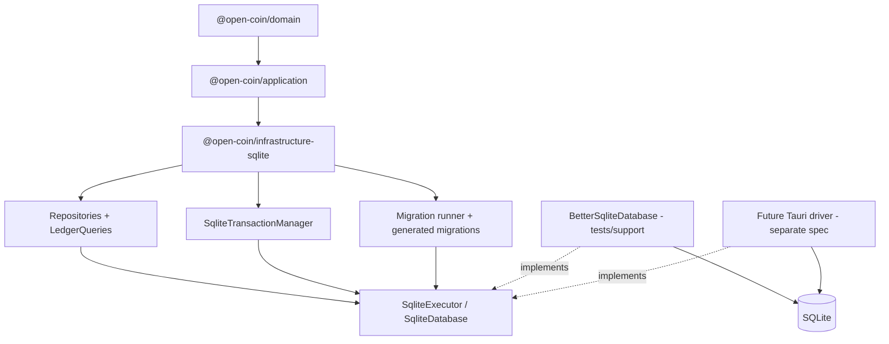
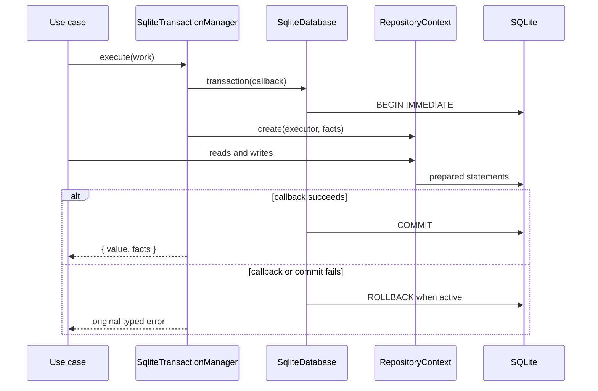

# Persistência Financeira em SQLite — Design

**Spec**: `.specs/features/financial-sqlite-persistence/spec.md`
**Context**: `.specs/features/financial-sqlite-persistence/context.md`
**Status**: Approved
**Approach**: Pacote único, neutro de plataforma, com driver Node restrito aos testes

---

## Architecture Overview

`@open-coin/infrastructure-sqlite` implementa as portas financeiras atuais por meio de uma abstração mínima de execução SQL. O pacote de produção não abre SQLite por conta própria e não conhece Node ou Tauri. Um runtime injeta um `SqliteDatabase`; os testes injetam `BetterSqliteDatabase` a partir de `tests/support`.

Os arquivos `.sql` são canônicos. Um gerador determinístico, executado explicitamente pelo mantenedor, produz e atualiza um módulo TypeScript versionado com o SQL e o checksum SHA-256. Build e testes usam esse módulo, portanto não dependem de filesystem ou loader de assets em runtime. Um comando `--check` falha se o módulo gerado divergir dos arquivos canônicos.



### Package Boundary

```text
packages/infrastructure-sqlite/
├── package.json
├── tsconfig.json
├── tsconfig.build.json
├── eslint.config.mjs
├── scripts/
│   └── generate-migrations.mjs
├── migrations/
│   └── 0001_initial_financial_ledger.sql
├── src/
│   ├── database/
│   │   ├── sqlite-value.ts
│   │   ├── sqlite-executor.ts
│   │   ├── sqlite-database.ts
│   │   ├── sqlite-error.ts
│   │   └── configure-sqlite-connection.ts
│   ├── migrations/
│   │   ├── generated-migrations.ts
│   │   ├── migrations.ts
│   │   ├── migration-errors.ts
│   │   └── sqlite-migration-runner.ts
│   ├── mappers/
│   │   ├── financial-book-mapper.ts
│   │   ├── ledger-account-mapper.ts
│   │   └── journal-entry-mapper.ts
│   ├── repositories/
│   │   ├── sqlite-fact-collector.ts
│   │   ├── sqlite-financial-book-repository.ts
│   │   ├── sqlite-ledger-account-repository.ts
│   │   ├── sqlite-journal-entry-repository.ts
│   │   └── create-sqlite-repository-context.ts
│   ├── queries/
│   │   ├── rows.ts
│   │   └── sqlite-ledger-queries.ts
│   ├── transaction/
│   │   └── sqlite-transaction-manager.ts
│   └── index.ts
└── tests/
    ├── contracts/
    ├── database/
    ├── migrations/
    ├── repositories/
    ├── queries/
    ├── transaction/
    └── support/
        ├── better-sqlite-database.ts
        ├── create-memory-adapter.ts
        └── create-sqlite-adapter.ts
```

`generated-migrations.ts` é versionado, tem cabeçalho “generated, do not edit” e não é alterado manualmente. `generate-migrations.mjs --check` recalcula SQL e checksums e compara o conteúdo esperado sem escrever.

---

## Research Findings

- `better-sqlite3.transaction()` não suporta callbacks assíncronos. O driver de teste usará `BEGIN IMMEDIATE`, `COMMIT` e `ROLLBACK` manualmente, sem misturar os dois modelos ([better-sqlite3 API](https://github.com/WiseLibs/better-sqlite3/blob/master/docs/api.md)).
- `BEGIN IMMEDIATE` adquire a transação de escrita no início. SQLite permite somente um writer simultâneo; a fila da instância evita transações sobrepostas na mesma conexão ([SQLite transactions](https://www.sqlite.org/lang_transaction.html)).
- Foreign keys são habilitadas por conexão e não podem ser ativadas no meio de uma transação ([SQLite foreign keys](https://sqlite.org/foreignkeys.html)).
- `RETURNING` existe desde SQLite 3.35. A reserva de sequência pode usar um único UPSERT com retorno textual ([SQLite RETURNING](https://www.sqlite.org/lang_returning.html)).
- `SUM(INTEGER)` lança erro em overflow intermediário. Saldo e running balance serão reduzidos em TypeScript com `bigint` a partir de `amount_minor` convertido para `TEXT`, preservando exatidão além do acumulador de 64 bits ([SQLite aggregate functions](https://www.sqlite.org/lang_aggfunc.html)).
- `better-sqlite3` aceita `BigInt`, mas esta feature mantém o contrato de driver sem `bigint`: repositories enviam strings decimais e queries recebem `TEXT`. O driver ativa safe integers apenas no statement de `execute` para converter `lastInsertRowid` sem perda ([better-sqlite3 integers](https://github.com/WiseLibs/better-sqlite3/blob/master/docs/integer.md)).
- Em WAL, `synchronous=FULL` adiciona sincronização no commit e preserva durabilidade diante de queda de energia. WAL permanece restrito a filesystem local ([SQLite PRAGMA](https://sqlite.org/pragma.html), [SQLite WAL](https://sqlite.org/wal.html)).

Context7 não está disponível neste ambiente. As decisões foram verificadas no código e na documentação primária acima.

---

## Code Reuse Analysis

### Existing Components to Leverage

| Component | Location | How to Use |
| --- | --- | --- |
| Repository ports | `packages/application/src/ports/repositories.ts` | Implementar as assinaturas sem criar uma segunda interface. |
| Transaction port | `packages/application/src/ports/transaction.ts` | Preservar `CommittedTransaction<T>` e callback assíncrono. |
| Query port and DTOs | `packages/application/src/ports/queries.ts` | Retornar os mesmos campos e strings decimais. |
| Application errors | `packages/application/src/ports/errors.ts` | Mapear falhas para os quatro códigos de infraestrutura já públicos. |
| Snapshot and restore APIs | `packages/domain/src/book/` e `packages/domain/src/ledger/` | Reidratar agregados sem duplicar invariantes ou factories. |
| Normal balance | `packages/domain/src/ledger/accounts/ledger-account.ts` | Converter saldo bruto para saldo visual nas queries. |
| Transaction behavior | `packages/infrastructure-memory/src/transaction/in-memory-transaction-manager.ts` | Reproduzir fila, coletor por transação, retorno de fatos e propagação do erro original. |
| Query behavior | `packages/infrastructure-memory/src/queries/in-memory-ledger-queries.ts` | Preservar ordem cronológica, running balance, reversões e isolamento por livro. |
| Package configuration | `packages/infrastructure-memory/` | Reusar scripts, TypeScript NodeNext, ESLint e convenções de exports. |
| Workspace gates | `package.json` e `turbo.json` | Integrar build, lint, check-types e test ao grafo existente. |

### Integration Points

| System | Integration Method |
| --- | --- |
| Application commands | Recebem `SqliteTransactionManager`, que monta `RepositoryContext` sobre o executor transacional. |
| Application queries | Recebem repositories SQLite para autorização e `SqliteLedgerQueries` para leitura. |
| Domain | Mappers chamam somente `restore` e `toSnapshot`; o domínio não importa infraestrutura. |
| Migrations | `initializeSqliteDatabase` configura a conexão e executa `SqliteMigrationRunner` com `sqliteMigrations`. |
| Tests | O mesmo harness recebe factories memory e SQLite; `better-sqlite3` é usado apenas pela factory SQLite. |
| Future Tauri runtime | Implementará `SqliteDatabase` e consumirá as mesmas migrations e adapters públicos. |

---

## Components

### SQLite Value and Parameter Types

- **Purpose**: Definir os únicos valores que podem cruzar a fronteira SQL.
- **Location**: `packages/infrastructure-sqlite/src/database/sqlite-value.ts`
- **Interfaces**:
  - `SqliteValue = string | number | Uint8Array | null`
  - `SqliteParameters = readonly SqliteValue[] | Readonly<Record<string, SqliteValue>>`
  - `SqliteExecutionResult = { rowsAffected: number; lastInsertRowId?: string }`
- **Dependencies**: Nenhuma.
- **Reuses**: Contrato fornecido no contexto da feature.

`bigint` não cruza essa fronteira. Mappers convertem dinheiro e sequência em string decimal; queries usam `CAST(... AS TEXT)`.

### SqliteExecutor

- **Purpose**: Executar statements sobre uma conexão ou uma transação já aberta.
- **Location**: `packages/infrastructure-sqlite/src/database/sqlite-executor.ts`
- **Interfaces**:
  - `execute(sql, parameters?): Promise<SqliteExecutionResult>`
  - `query<Row>(sql, parameters?): Promise<Row[]>`
  - `executeBatch(sql): Promise<void>`
- **Dependencies**: Tipos SQLite.
- **Reuses**: Nenhum driver concreto.

`query` aceita qualquer statement que devolva rows, inclusive UPSERT com `RETURNING`. `executeBatch` é reservado para SQL canônico de migration e configuração sem valores externos.

### SqliteDatabase

- **Purpose**: Acrescentar lifecycle e transação à execução SQL.
- **Location**: `packages/infrastructure-sqlite/src/database/sqlite-database.ts`
- **Interfaces**:
  - `transaction<T>(work: (transaction: SqliteExecutor) => Promise<T>): Promise<T>`
  - `close(): Promise<void>`
- **Dependencies**: `SqliteExecutor`.
- **Reuses**: Assinatura aprovada na spec.

O executor entregue ao callback é um wrapper transacional escopado, não a instância pública do database. Ele acessa diretamente a conexão enquanto a transação está ativa e é invalidado depois de commit ou rollback. Operações chamadas na instância pública são enfileiradas e nunca entram acidentalmente na transação de outro callback.

### Connection Configuration and Initialization

- **Purpose**: Aplicar PRAGMAs antes de migrations e oferecer um bootstrap único.
- **Location**: `packages/infrastructure-sqlite/src/database/configure-sqlite-connection.ts`
- **Interfaces**:
  - `configureSqliteConnection(database, { inMemory }): Promise<void>`
  - `initializeSqliteDatabase(database, { inMemory, migrations? }): Promise<void>`
- **Dependencies**: `SqliteDatabase`, runner e migrations padrão.
- **Reuses**: Nenhum estado global.

Ordem obrigatória: configurar foreign keys/busy timeout, configurar WAL/FULL quando aplicável, executar migrations. Os PRAGMAs efetivos são consultados nos testes; o código não considera a execução do statement como prova suficiente.

### Migration Generator

- **Purpose**: Transformar arquivos SQL canônicos em dados TypeScript portáveis com SHA-256.
- **Location**: `packages/infrastructure-sqlite/scripts/generate-migrations.mjs`
- **Interfaces**:
  - `pnpm generate:migrations`: atualiza `generated-migrations.ts`.
  - `pnpm check:migrations`: compara sem escrever e retorna status não zero em divergência.
- **Dependencies**: Somente módulos Node usados em build (`fs`, `path`, `crypto`).
- **Reuses**: Convenção ESM do workspace.

O gerador normaliza somente final de linha para LF e garante exatamente um newline final antes de calcular SHA-256. Ele ordena pelo prefixo numérico, rejeita gaps, versões duplicadas e nomes inválidos. O runtime não recalcula checksum e não depende de Node.

### SqliteMigrationRunner

- **Purpose**: Validar o histórico e aplicar migrations pendentes atomicamente.
- **Location**: `packages/infrastructure-sqlite/src/migrations/sqlite-migration-runner.ts`
- **Interfaces**:
  - `migrate(): Promise<void>`
  - erros `InvalidMigrationPlanError`, `UnknownAppliedMigrationError`, `ModifiedMigrationError`.
- **Dependencies**: `SqliteDatabase`, `SqliteMigration[]`.
- **Reuses**: Migrations geradas.

Fluxo:

1. Validar a lista em memória antes de tocar o banco.
2. Criar `schema_migrations` dentro de uma transação curta.
3. Ler todas as migrations aplicadas em ordem.
4. Rejeitar versão desconhecida ou checksum modificado.
5. Aplicar cada pendência em uma transação própria e inserir seu registro no mesmo callback.

O SQL de migration não contém `BEGIN`, `COMMIT` ou `ROLLBACK`.

### Aggregate Mappers

- **Purpose**: Isolar nomes de colunas, parsing e serialização.
- **Location**: `packages/infrastructure-sqlite/src/mappers/`
- **Interfaces**:
  - `FinancialBookMapper.toDomain(row)` e `toPersistence(book)`.
  - `LedgerAccountMapper.toDomain(row)` e `toPersistence(account)`.
  - `JournalEntryMapper.toDomain(rows)` e `toPersistence(entry)`.
- **Dependencies**: Snapshot/restore APIs de domínio.
- **Reuses**: `FinancialBook.restore`, `LedgerAccount.restore`, `JournalEntry.restore` e `toSnapshot`.

Os parsers validam shapes vindos do driver: strings, números de versão seguros, enums conhecidos, nullabilidade e strings decimais. Corrupção estrutural falha antes de construir o aggregate. Mappers não conhecem `SqliteExecutor` e não puxam fatos.

### SqliteFactCollector

- **Purpose**: Manter fatos pendentes dentro do callback transacional.
- **Location**: `packages/infrastructure-sqlite/src/repositories/sqlite-fact-collector.ts`
- **Interfaces**:
  - `record(facts): void`
  - `pull(): readonly DomainFact[]`
- **Dependencies**: Porta `DomainFactCollector`.
- **Reuses**: Semântica do coletor em memória.

A instância nunca é compartilhada entre transações. O transaction manager só chama `pull` depois de o callback terminar; o resultado só retorna ao consumidor depois do commit do database.

### SqliteFinancialBookRepository

- **Purpose**: Implementar persistência e concorrência otimista de livros.
- **Location**: `packages/infrastructure-sqlite/src/repositories/sqlite-financial-book-repository.ts`
- **Interfaces**: `findById`, `add`, `save`.
- **Dependencies**: `SqliteExecutor`, mapper, error mapping e coletor opcional.
- **Reuses**: `FinancialBookRepository`.

`add` exige versão zero. `save` exige aggregate na versão `expectedVersion + 1` antes do SQL e usa `UPDATE ... WHERE id = ? AND version = ?`. Se zero rows forem afetadas, um lookup por ID separa not found de conflito.

### SqliteLedgerAccountRepository

- **Purpose**: Implementar persistência e buscas de conta.
- **Location**: `packages/infrastructure-sqlite/src/repositories/sqlite-ledger-account-repository.ts`
- **Interfaces**: `findById`, `findBySystemPurpose`, `existsWithName`, `add`, `save`.
- **Dependencies**: `SqliteExecutor`, mapper, error mapping e coletor opcional.
- **Reuses**: `LedgerAccountRepository` e normalização já persistida pelo domínio.

As buscas sempre incluem `book_id` quando o contrato o fornece. A constraint `(book_id, kind, normalized_name)` é autoridade contra races; `existsWithName` continua útil para o erro antecipado do caso de uso.

### SqliteJournalEntryRepository

- **Purpose**: Persistir entry/postings, links de reversão e sequência por livro.
- **Location**: `packages/infrastructure-sqlite/src/repositories/sqlite-journal-entry-repository.ts`
- **Interfaces**: `findById`, `findActiveOpeningBalanceByAccount`, `reserveNextSequence`, `add`, `save`.
- **Dependencies**: `SqliteExecutor`, journal mapper, integer guard, error mapping e coletor opcional.
- **Reuses**: `JournalEntryRepository`.

Decisões de SQL:

- `findById` usa um `JOIN` e `ORDER BY p.position` em um único statement.
- `add` insere entry e postings em ordem. Seu contrato operacional exige executor transacional; o transaction manager é a fronteira usada pelos casos de uso.
- `save` altera apenas `reversed_by_id` e `version`, os campos mutáveis do snapshot atual.
- `reserveNextSequence` usa `INSERT ... ON CONFLICT(book_id) DO UPDATE SET last_sequence = last_sequence + 1 RETURNING CAST(last_sequence AS TEXT)`.
- `findActiveOpeningBalanceByAccount` usa dois aliases de posting e a conta de sistema do mesmo livro, sem carregar candidatos em memória.

### Repository Context Factory

- **Purpose**: Construir uma unidade coerente de repositories e fatos sobre um executor.
- **Location**: `packages/infrastructure-sqlite/src/repositories/create-sqlite-repository-context.ts`
- **Interfaces**:
  - `createSqliteRepositoryContext(executor, facts): RepositoryContext`
- **Dependencies**: Três repositories e `DomainFactCollector`.
- **Reuses**: Shape atual de `RepositoryContext`.

### SqliteTransactionManager

- **Purpose**: Adaptar `SqliteDatabase.transaction` ao contrato de aplicação.
- **Location**: `packages/infrastructure-sqlite/src/transaction/sqlite-transaction-manager.ts`
- **Interfaces**:
  - `execute<T>(work): Promise<CommittedTransaction<T>>`
- **Dependencies**: `SqliteDatabase`, context factory, fact collector e error mapping.
- **Reuses**: `TransactionManager`.



O manager reconhece `ApplicationError` e `DomainError` e os relança. Somente erros do driver são sanitizados e mapeados.

### SqliteLedgerQueries

- **Purpose**: Implementar saldo e extrato sem reidratar aggregates.
- **Location**: `packages/infrastructure-sqlite/src/queries/sqlite-ledger-queries.ts`
- **Interfaces**: `getAccountBalance`, `getAccountStatement`.
- **Dependencies**: `SqliteExecutor` e `normalBalanceOf`.
- **Reuses**: `LedgerQueries` e DTOs públicos.

As duas operações carregam conta/livro e postings com filtros por `book_id`. Valores usam `CAST(p.amount_minor AS TEXT)` e sequência usa `CAST(je.sequence AS TEXT)`. O adapter converte cada valor para `bigint`, calcula saldo/running balance em ordem ascendente e serializa o resultado. Essa escolha evita overflow intermediário de `SUM(INTEGER)` e mantém o comportamento do adapter em memória.

### BetterSqliteDatabase Test Driver

- **Purpose**: Provar o contrato com SQLite real em Node.
- **Location**: `packages/infrastructure-sqlite/tests/support/better-sqlite-database.ts`
- **Interfaces**: Implementa `SqliteDatabase`.
- **Dependencies**: `better-sqlite3` como devDependency.
- **Reuses**: Tipos públicos do pacote.

Detalhes:

- `execute` usa prepared statement e binding posicional/nomeado; o statement ativa safe integers para `lastInsertRowid`.
- `query` usa `.all` e depende dos casts explícitos do SQL para campos de 64 bits.
- `executeBatch` usa `database.exec` somente para SQL confiável sem parâmetros.
- Toda operação pública entra na fila da instância. Uma query direta não pode executar dentro da transação aberta por outro consumidor.
- `transaction` ocupa uma posição indivisível na fila, cria um executor escopado, executa `BEGIN IMMEDIATE`, aguarda o callback, confirma ou reverte, invalida o executor e preserva o erro original.
- `close` marca a instância como closing, rejeita novas submissões, aguarda o fim da fila, fecha uma vez e deixa a instância permanentemente encerrada.

O driver não é exportado por `src/index.ts` nem incluído em `files: ["dist"]`.

### Contract Harnesses

- **Purpose**: Executar as mesmas expectativas contra memory e SQLite.
- **Location**: `packages/infrastructure-sqlite/tests/contracts/`
- **Interfaces**:
  - `runFinancialBookRepositoryContract(factory)`
  - `runLedgerAccountRepositoryContract(factory)`
  - `runJournalEntryRepositoryContract(factory)`
  - `runLedgerQueriesContract(factory)`
  - `runFinancialUseCaseContract(factory)`
- **Dependencies**: `@open-coin/infrastructure-memory` como devDependency e duas adapter factories.
- **Reuses**: Builders e adapters determinísticos já existentes no pacote memory.

Cada harness é invocado duas vezes no pacote SQLite, uma por factory. Os testes existentes do pacote memory permanecem; a suíte compartilhada adiciona prova comparativa sem fazer memory depender de SQLite.

---

## Data Models

### Driver Contract

```typescript
export type SqliteValue = string | number | Uint8Array | null;

export type SqliteParameters =
  | readonly SqliteValue[]
  | Readonly<Record<string, SqliteValue>>;

export type SqliteExecutionResult = {
  readonly rowsAffected: number;
  readonly lastInsertRowId?: string;
};

export interface SqliteExecutor {
  execute(sql: string, parameters?: SqliteParameters): Promise<SqliteExecutionResult>;
  query<Row extends Record<string, unknown>>(
    sql: string,
    parameters?: SqliteParameters,
  ): Promise<Row[]>;
  executeBatch(sql: string): Promise<void>;
}

export interface SqliteDatabase extends SqliteExecutor {
  transaction<T>(work: (transaction: SqliteExecutor) => Promise<T>): Promise<T>;
  close(): Promise<void>;
}
```

### SqliteMigration

```typescript
export interface SqliteMigration {
  readonly version: number;
  readonly name: string;
  readonly checksum: string;
  readonly sql: string;
}
```

### Schema

| Table | Columns | Keys and checks |
| --- | --- | --- |
| `schema_migrations` | `version`, `name`, `checksum`, `applied_at` | PK version; nonempty name/checksum/timestamp; `STRICT`. |
| `financial_books` | `id`, `name`, `base_currency`, `timezone`, `version` | PK id; unique `(id)`; trimmed nonempty name/timezone; currency pattern; version >= 0. |
| `ledger_accounts` | `id`, `book_id`, `name`, `normalized_name`, `kind`, `status`, `system_purpose`, `version` | PK id; unique `(id, book_id)`; FK book; enum checks; unique name key; partial unique system purpose; version >= 0. |
| `journal_sequences` | `book_id`, `last_sequence` | PK/FK book; `last_sequence` between 0 and signed 64-bit max. |
| `journal_entries` | `id`, `book_id`, `occurred_on`, `recorded_at`, `sequence`, `description`, `currency`, `origin`, `reversal_of_id`, `reversed_by_id`, `version` | PK id; unique `(id, book_id)` and `(book_id, sequence)`; same-book self FKs; unique non-null reversal links; enum/currency/version checks. |
| `postings` | `id`, `book_id`, `journal_entry_id`, `account_id`, `position`, `amount_minor`, `currency` | PK id; same-book FKs to entry/account; unique `(journal_entry_id, position)`; nonzero amount; position >= 0; currency pattern. |

### Index Plan

| Index | Supports |
| --- | --- |
| `ix_ledger_accounts_book` on `(book_id)` | Book FK checks and account listing. |
| `ux_ledger_account_name` on `(book_id, kind, normalized_name)` | Contractual name uniqueness and `existsWithName`. |
| `ux_system_account_purpose` on `(book_id, system_purpose) WHERE system_purpose IS NOT NULL` | `findBySystemPurpose` and one system account per purpose. |
| `ix_journal_entries_book_date_sequence` on `(book_id, occurred_on, sequence)` | Balance/statement range and order. |
| `ix_journal_entries_reversal_of` on `(book_id, reversal_of_id)` | Reversal FK and uniqueness. |
| `ix_journal_entries_reversed_by` on `(book_id, reversed_by_id)` | Reverse link FK and uniqueness. |
| `ix_postings_entry` on `(book_id, journal_entry_id, position)` | Journal hydration and entry FK. |
| `ix_postings_account_entry` on `(book_id, account_id, journal_entry_id)` | Balance/statement and account FK. |

IDs são globalmente únicos pelo contrato atual, mas os pares `(id, book_id)` existem para que foreign keys compostas façam o banco rejeitar relações entre livros.

---

## Error Handling Strategy

| Error Scenario | Handling | Public Impact |
| --- | --- | --- |
| Aggregate novo com versão diferente de zero | Rejeição anterior ao SQL | `OPTIMISTIC_CONCURRENCY_FAILURE`. |
| PK, nome ou propósito duplicado | `mapSqliteError` reconhece extended code | `DUPLICATE_ENTITY` com mensagem genérica. |
| FK, CHECK, datatype, overflow ou erro SQLite inesperado | Normalizar causa e sanitizar | `UNEXPECTED_ERROR` sem SQL ou caminho. |
| `save` afeta zero rows e ID não existe | Lookup posterior por ID | `ENTITY_NOT_FOUND`. |
| `save` afeta zero rows e ID existe | Lookup posterior por ID | `OPTIMISTIC_CONCURRENCY_FAILURE`. |
| Callback lança `ApplicationError` ou `DomainError` | Rollback e preservação do mesmo objeto | A fronteira de aplicação mantém código e detalhes existentes. |
| BEGIN/statement/COMMIT falha | Rollback quando `inTransaction`; mapear driver error | `UNEXPECTED_ERROR` sanitizado. |
| Migration aplicada desconhecida | Abort antes de pendências | `UnknownAppliedMigrationError`. |
| Checksum aplicado diverge | Abort antes de pendências | `ModifiedMigrationError`. |
| Operação após `close` | Rejeição local determinística | Erro de lifecycle sem reabrir conexão. |

`parseSqliteError` nunca usa substring da mensagem para decidir constraints quando um código estendido está disponível. A mensagem e o `cause` originais ficam apenas no erro interno.

---

## Test Architecture

### Adapter Factories

```typescript
interface FinancialPersistenceTestAdapter {
  readonly transactionManager: TransactionManager;
  readonly books: FinancialBookRepository;
  readonly accounts: LedgerAccountRepository;
  readonly journalEntries: JournalEntryRepository;
  readonly queries: LedgerQueries;
  close(): Promise<void>;
}
```

- Factory memory cria `InMemoryStore`, repositories, queries e manager atuais.
- Factory SQLite cria `BetterSqliteDatabase(":memory:")`, inicializa PRAGMAs/migrations, repositories fora da transação para leituras de verificação, queries e manager.
- Cada `it` recebe um adapter novo e o fecha em `finally`/`afterEach`.

### Test Layers

| Layer | Test Type | Primary Outcomes |
| --- | --- | --- |
| Driver abstraction and Node adapter | Integration | binding, results, close, FIFO global, executor escopado, query externa bloqueada e BEGIN/commit/rollback. |
| Migration generator | Unit | ordering, naming, checksum, check mode, deterministic output. |
| Migration runner | Integration | empty/latest/unknown/modified/failing migration, integrity checks. |
| Mappers | Unit | exact round-trip, invalid rows, no facts. |
| Repositories | Shared contract + integration | add/find/save, copies, constraints, version conflicts, book isolation. |
| Journal transaction | Integration | entry/postings/order/sequence/facts and rollback. |
| Ledger queries | Shared contract + integration | signs, as-of, order, running balance, reversal, bigint. |
| Application use cases | Shared contract | same result/error/facts against memory and SQLite. |
| Package boundary | Structural/build | no forbidden production imports or public Node driver. |

Tests não afirmam texto SQL interno. Eles afirmam snapshots, DTOs, erros, transições e estado persistido definidos na spec.

---

## Requirement-to-Component Traceability

| Requirements | Components |
| --- | --- |
| FSP-01–FSP-07 | Package boundary, value types, `SqliteExecutor`, `SqliteDatabase`. |
| FSP-08–FSP-14 | Connection configuration, BetterSqliteDatabase, integer guard. |
| FSP-15–FSP-26 | Generator, migrations, runner, schema and indexes. |
| FSP-27–FSP-36 | Mappers and three repositories. |
| FSP-37–FSP-43 | Journal repository, context factory, fact collector, transaction manager and Node driver queue. |
| FSP-44–FSP-50 | `SqliteLedgerQueries` and query contract harness. |
| FSP-51–FSP-58 | Error mapping, shared harnesses, integrity suites and package gates. |

Todos os 58 requisitos possuem componente e estratégia de teste. Nenhum requisito exige alteração no domínio.

---

## Risks & Concerns

| Concern | Location (file:line) | Impact | Mitigation |
| --- | --- | --- | --- |
| `Money` aceita `bigint` arbitrário, maior que o intervalo de SQLite | `packages/domain/src/shared/money.ts:10` | Um aggregate válido no domínio pode não ser persistível neste adapter. | Guard explícito de 64 bits antes do SQL e teste dos dois limites; erro sanitizado conforme spec aprovada. |
| `JournalEntry.sequence` é string decimal sem limite de 64 bits | `packages/domain/src/ledger/journal/journal-entry.ts:20` | Reserva pode atingir valor que não cabe em `INTEGER`. | `journal_sequences` aplica limite e reserva atômica aborta antes de wrap/overflow. |
| A taxonomia não distingue foreign key, check ou faixa de persistência | `packages/application/src/ports/errors.ts:3` | Todos esses defeitos chegam como `UNEXPECTED_ERROR`. | Manter mensagens sanitizadas e registrar taxonomia específica como feature adiada. |
| `SUM(INTEGER)` pode estourar antes de valores opostos se anularem | `packages/infrastructure-memory/src/queries/in-memory-ledger-queries.ts:27` | SQL direto com `SUM` teria comportamento mais estreito que o adapter memory. | Ler amounts como `TEXT` e reduzir com `bigint` em TypeScript. |
| Reversão exige inserir o reversor antes de salvar o link do original | `packages/application/src/ledger/journal/reverse-journal-entry.ts:65` | FKs imediatas precisam aceitar esse order. | `reversal_of_id` aponta para original já existente; depois o save pode apontar `reversed_by_id` para o reversor dentro da mesma transação. |
| Repository de journal usa múltiplos statements | `packages/application/src/ports/repositories.ts:36` | Uso direto fora de transação pode deixar entry parcial. | Casos de uso obtêm o repository pelo manager; documentação e testes de rollback tornam essa precondição explícita. |
| Callback assíncrono mantém uma conexão aberta entre event-loop ticks | `packages/application/src/ports/transaction.ts:8` | Operação externa na mesma conexão poderia participar da transação sem intenção. | Enfileirar toda operação pública e entregar ao callback um executor transacional escopado, invalidado ao terminar. |
| Contract tests existentes estão ligados ao pacote memory | `packages/infrastructure-memory/src/repositories/in-memory-ledger-account-repository.ts:16` | Duplicar testes permitiria divergência silenciosa. | Novos harnesses no pacote SQLite executam as mesmas expectativas contra duas factories. |
| Não existe CI específico no repositório | `package.json:5` | Gates dependem do comando local até existir workflow. | Tasks usarão os scripts Turbo atuais e registrarão evidência local sem alegar CI. |

---

## Tech Decisions

| Decision | Choice | Rationale |
| --- | --- | --- |
| Topologia do adapter | Um pacote de produção neutro; driver Node somente em `tests/support` | Evita dependência nativa e deixa o contrato pronto para Tauri. |
| Entrega das migrations | SQL canônico + módulo TS gerado e versionado + `--check` | Runtime portável, build determinístico e drift detectável. |
| Transação Node | Statements manuais, fila FIFO para toda operação pública e executor transacional escopado | Callback da aplicação é assíncrono; transações não podem se sobrepor nem capturar queries externas. |
| Lock de escrita | `BEGIN IMMEDIATE` | Falha por writer lock acontece antes de leituras seguidas de escrita. |
| Reserva de sequência | UPSERT atômico com `RETURNING` textual | Evita select-then-update e preserva ordem por livro. |
| Agregação financeira | Redução `bigint` em TypeScript sobre rows textuais | Evita `SUM(INTEGER)` overflow e mantém equivalência com memory. |
| Integridade entre livros | Foreign keys compostas com `book_id` | O banco impede relações cruzadas mesmo com bug no adapter. |
| Regras de ledger | Sem triggers para balanceamento ou reversão | Essas invariantes continuam no domínio e na aplicação. |
| Testes compartilhados | Harnesses no pacote SQLite executados contra memory e SQLite | Prova equivalência sem introduzir outro pacote ou ciclo de dependência. |

As decisões sobre abstração de driver e neutralidade de plataforma são padrão arquitetural do projeto e foram registradas em `.specs/STATE.md` como `AD-004`.
